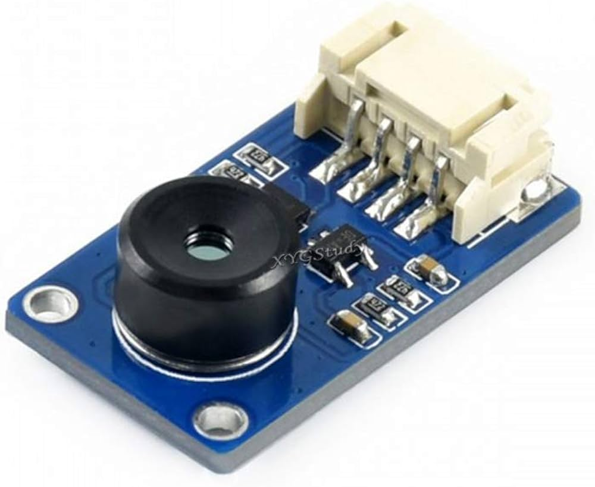
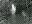

# MLX90640을 사용한 Object Detection 

<br/>
<br/>

# 1차 센서 테스트 및 후처리

<br/>

## 1. 개요
라즈베리파이 4B에 MLX90640를 사용하여 Object Detection을 수행하는 프로젝트 수행 중 후처리를 통한 딥러닝 학습 가능 여부 판단 을 위한 테스트 프로젝트

<br/>

## 2. 대표 라이브러리
- **adafruit_mlx90640**: mlx90640을 사용하기 위한 라이브러리

- **tensorflow**: object detection을 위한 라이브러리

- **cv2**: 영상 녹화 및 노이즈 필터링을 위한 라이브러리

- **scipy**: 가우시안 필터 및 픽셀 보간을 위한 라이브러리

<br/>

## 3. 하드웨어

- **RaspberryPi4B 8GB**

- **MLX90640**
  - IR Array Thermal Imaging Camera 32×24 Pixels 110° Field of View I2C Interface 3.3V/5V
  
  

<br/>

## 4. 알고리즘

1. MLX90640 센서에서 데이터 프레임 get

2. 인체 온도 범위 외의 픽셀을 마스킹
3. 데이터 정규화: 데이터 값을 0-255 범위로 변환
4. 노이즈 제거: NLmeans 필터를 사용하여 이미지에서 노이즈 제거
5. 이미지를 가우시안 필터를 사용해 부드러운 쉐입으로 이미지 생성
6. 데이터에서 유효한 값을 추출
7. 유효한 값을 기반으로 빈 픽셀을 보간하여 완전한 이미지를 생성
8. 인체 온도 범위 외의 픽셀을 마스킹 
9.  이미지를 0-1 범위로 정규화 (전처리)
10. 모델에 이미지 입력
11. 녹화를 위해 이미지를 3 채널로 확장
12. 예측 결과에 따라 텍스트 표시

<br/>

```python
# MLX90640 센서에서 데이터 프레임 get
self.mlx.getFrame(self.frame)

# 인체 온도 범위 외의 픽셀을 마스킹
self.frame[(self.frame <= 23) | (self.frame > 40)] = 0

# 데이터 shape 변환
data_array_raw = np.fliplr(np.reshape(self.frame, self.mlx_shape))

# 데이터 정규화: 데이터 값을 0-255 범위로 변환
data_array_raw_normalized_uint8 = ((data_array_raw - np.min(data_array_raw)) / (np.max(data_array_raw) - np.min(data_array_raw)) * 255).astype(np.uint8)

# 노이즈 제거: NLmeans 필터를 사용하여 이미지에서 노이즈 제거
img_array_uint8_denoised = cv2.fastNlMeansDenoising(data_array_raw_normalized_uint8, None, h=23, searchWindowSize=33)

# 이미지를 다시 실수 값 범위로 변환
img_float64_denoised = (img_array_uint8_denoised.astype(float) / 255) * (np.max(data_array_raw) - np.min(data_array_raw)) + np.min(data_array_raw)

# 이미지를 가우시안 필터를 사용해 부드러운 쉐입으로 이미지 생성
data_array_smoothed = ndimage.gaussian_filter(img_float64_denoised, sigma=0.3)

# 데이터에서 유효한 값을 추출
x_idx_valid_values, y_idx_valid_values = np.where(data_array_smoothed > 0)
valid_values = data_array_smoothed[x_idx_valid_values, y_idx_valid_values]

# 보간: 유효한 값을 기반으로 빈 픽셀을 보간하여 완전한 이미지를 생성
x_idx_all, y_idx_all = np.indices(data_array_smoothed.shape)
interpolated_data_array = interpolate.griddata((x_idx_valid_values, y_idx_valid_values), valid_values, (x_idx_all, y_idx_all), 'cubic')

# 인체 온도 범위 외의 픽셀을 마스킹 (온도 가정)
interpolated_data_array[(interpolated_data_array <= 25) | (interpolated_data_array > 40)] = 0

# 이미지를 0-1 범위로 정규화 (전처리)
image = (interpolated_data_array - np.min(interpolated_data_array)) / (np.max(interpolated_data_array) - np.min(interpolated_data_array))

# 모델에 이미지 입력
predictions = self.model.predict(np.expand_dims(image, axis=0))  # 이미지를 배치 차원을 추가하여 모델에 전달
        
# 이미지를 0-255 범위로 변환
img_array = (interpolated_data_array - np.min(interpolated_data_array)) / (np.max(interpolated_data_array) - np.min(interpolated_data_array)) * 255
        
# 녹화를 위해 이미지를 3 채널로 확장
expanded_img_array = np.expand_dims(img_array, axis=2)
expanded_img_array = np.tile(expanded_img_array, (1, 1, 3))

# 데이터 타입을 uint8로 변환
expanded_img_array = expanded_img_array.astype(np.uint8)
        
# 예측 결과에 따라 텍스트 표시
text = 'Person Detected' if predictions > 0.5 else 'No Person'
```

<br/>

###  1.5M 기준 후처리 비교
| 원본 | 후처리 | 
|:---:|:---:|
|| |

<br/>
<br/>
<br/>

| 1M | 1.5M | 2M | 3M |
| :---: | :---: | :---: | :---: |
|  | |  | |


## 5. 사용한 데이터셋

with human data (24 x 32)


<br/>
<br/>
<br/>

without human data (24 x 32)


## 6. 사용한 학습 모델

### CNN Model 아키텍쳐 정의 

``` python
model.add(Conv2D(32, (3, 3), activation='relu', input_shape=(image_height, image_width, 1)))
model.add(MaxPooling2D((2, 2)))

model.add(Conv2D(64, (3, 3), activation='relu'))
model.add(MaxPooling2D((2, 2)))

model.add(Conv2D(128, (3, 3), activation='relu'))
model.add(MaxPooling2D((2, 2)))

model.add(Flatten())
model.add(Dense(128, activation='relu'))
model.add(Dense(1, activation='sigmoid'))
```

### Model Training

``` bash
85/85 [==============================] - 14s 106ms/step - loss: 0.1039 - accuracy: 0.9670 - val_loss: 0.0079 - val_accuracy: 0.9985
Epoch 2/5
85/85 [==============================] - 1s 16ms/step - loss: 0.0090 - accuracy: 0.9974 - val_loss: 0.0026 - val_accuracy: 0.9985
Epoch 3/5
85/85 [==============================] - 1s 16ms/step - loss: 0.0043 - accuracy: 0.9981 - val_loss: 0.0062 - val_accuracy: 0.9985
Epoch 4/5
85/85 [==============================] - 1s 16ms/step - loss: 0.0187 - accuracy: 0.9944 - val_loss: 0.0086 - val_accuracy: 0.9956
Epoch 5/5
85/85 [==============================] - 1s 16ms/step - loss: 0.0078 - accuracy: 0.9978 - val_loss: 0.0027 - val_accuracy: 1.0000
```

### 모델 평가

``` bash
22/22 [==============================] - 0s 9ms/step - loss: 0.0027 - accuracy: 1.0000
Test accuracy: 1.0
```

## 7. 1차 학습 결과


<br/>
<br/>
<br/>
<br/>
<br/>

# 2차 RetinaNet을 사용한 Object Detection

<br/>
<br/>

## 1. 개요
라즈베리파이 4B에 MLX90640를 사용하여 RetinaNet Object Detection을 수행하는 프로젝트 수행

<br/>
<br/>

## 2. 버전 및 라이브러리

- ### **GPU** ###

  - GeForce RTX 3090
  
  - NVIDIA-SMI 470.182.03   

  - Driver Version: 470.182.03

- ### **CUDA Version** ###

  - CUDA 11.4

- ### ***CUDNN Version*** ###

  - CUDNN_MAJOR 8

  - CUDNN_MINOR 9

  - CUDNN_PATCHLEVEL 5

``` bash
+-----------------------------------------------------------------------------+
| NVIDIA-SMI 470.182.03   Driver Version: 470.182.03   CUDA Version: 11.4     |
|-------------------------------+----------------------+----------------------+
| GPU  Name        Persistence-M| Bus-Id        Disp.A | Volatile Uncorr. ECC |
| Fan  Temp  Perf  Pwr:Usage/Cap|         Memory-Usage | GPU-Util  Compute M. |
|                               |                      |               MIG M. |
|===============================+======================+======================|
|   0  NVIDIA GeForce ...  Off  | 00000000:1D:00.0 Off |                  N/A |
| 37%   44C    P0   111W / 350W |      0MiB / 24268MiB |      0%      Default |
|                               |                      |                  N/A |
+-------------------------------+----------------------+----------------------+
|   1  NVIDIA GeForce ...  Off  | 00000000:1F:00.0 Off |                  N/A |
| 37%   42C    P0   111W / 350W |      0MiB / 24268MiB |      0%      Default |
|                               |                      |                  N/A |
+-------------------------------+----------------------+----------------------+
|   2  NVIDIA GeForce ...  Off  | 00000000:20:00.0 Off |                  N/A |
| 37%   38C    P0   103W / 350W |      0MiB / 24268MiB |      0%      Default |
|                               |                      |                  N/A |
+-------------------------------+----------------------+----------------------+
|   3  NVIDIA GeForce ...  Off  | 00000000:21:00.0 Off |                  N/A |
| 37%   45C    P0   107W / 350W |      0MiB / 24268MiB |      0%      Default |
|                               |                      |                  N/A |
+-------------------------------+----------------------+----------------------+
|   4  NVIDIA GeForce ...  Off  | 00000000:22:00.0 Off |                  N/A |
| 37%   43C    P0   105W / 350W |      0MiB / 24268MiB |      0%      Default |
|                               |                      |                  N/A |
+-------------------------------+----------------------+----------------------+
|   5  NVIDIA GeForce ...  Off  | 00000000:23:00.0 Off |                  N/A |
| 39%   42C    P0   105W / 350W |      0MiB / 24268MiB |      0%      Default |
|                               |                      |                  N/A |
+-------------------------------+----------------------+----------------------+
|   6  NVIDIA GeForce ...  Off  | 00000000:24:00.0 Off |                  N/A |
| 41%   40C    P0   111W / 350W |      0MiB / 24268MiB |      1%      Default |
|                               |                      |                  N/A |
+-------------------------------+----------------------+----------------------+

+-----------------------------------------------------------------------------+
| Processes:                                                                  |
|  GPU   GI   CI        PID   Type   Process name                  GPU Memory |
|        ID   ID                                                   Usage      |
|=============================================================================|
|  No running processes found                                                 |
+-----------------------------------------------------------------------------+
```

<br/>
<br/>

### **Python version**

  -  Python 3.6.13

<br/>

### **RetinaNet.yaml**

``` yaml
name: retina
channels:
  - defaults
dependencies:
  - _libgcc_mutex=0.1=main
  - _openmp_mutex=5.1=1_gnu
  - ca-certificates=2023.08.22=h06a4308_0
  - certifi=2021.5.30=py36h06a4308_0
  - ld_impl_linux-64=2.38=h1181459_1
  - libffi=3.3=he6710b0_2
  - libgcc-ng=11.2.0=h1234567_1
  - libgomp=11.2.0=h1234567_1
  - libstdcxx-ng=11.2.0=h1234567_1
  - ncurses=6.4=h6a678d5_0
  - openssl=1.1.1w=h7f8727e_0
  - pip=21.2.2=py36h06a4308_0
  - python=3.6.13=h12debd9_1
  - readline=8.2=h5eee18b_0
  - setuptools=58.0.4=py36h06a4308_0
  - sqlite=3.41.2=h5eee18b_0
  - tk=8.6.12=h1ccaba5_0
  - wheel=0.37.1=pyhd3eb1b0_0
  - xz=5.4.2=h5eee18b_0
  - zlib=1.2.13=h5eee18b_0
  - pip:
    - absl-py==0.15.0
    - astunparse==1.6.3
    - backcall==0.2.0
    - cached-property==1.5.2
    - cachetools==4.2.4
    - charset-normalizer==2.0.12
    - clang==5.0
    - cycler==0.11.0
    - cython==3.0.2
    - dataclasses==0.8
    - decorator==5.1.1
    - entrypoints==0.4
    - flatbuffers==1.12
    - gast==0.4.0
    - google-auth==1.35.0
    - google-auth-oauthlib==0.4.6
    - google-pasta==0.2.0
    - grpcio==1.48.2
    - h5py==3.1.0
    - idna==3.4
    - importlib-metadata==4.8.3
    - ipykernel==5.5.6
    - ipython==7.16.3
    - ipython-genutils==0.2.0
    - jedi==0.17.2
    - jupyter-client==7.1.2
    - jupyter-core==4.9.2
    - keras==2.6.0
    - keras-applications==1.0.8
    - keras-preprocessing==1.1.2
    - keras-resnet==0.2.0
    - keras-retinanet==1.0.0
    - kiwisolver==1.3.1
    - markdown==3.3.7
    - matplotlib==3.3.4
    - nest-asyncio==1.5.8
    - numpy==1.19.5
    - oauthlib==3.2.2
    - opencv-python==3.3.0.10
    - opt-einsum==3.3.0
    - parso==0.7.1
    - pexpect==4.8.0
    - pickleshare==0.7.5
    - pillow==8.4.0
    - progressbar2==3.55.0
    - prompt-toolkit==3.0.36
    - protobuf==3.19.6
    - ptyprocess==0.7.0
    - pyasn1==0.5.0
    - pyasn1-modules==0.3.0
    - pygments==2.14.0
    - pyparsing==3.1.1
    - python-dateutil==2.8.2
    - python-utils==3.5.2
    - python-version==0.0.2
    - pyyaml==6.0.1
    - pyzmq==25.1.1
    - requests==2.27.1
    - requests-oauthlib==1.3.1
    - rsa==4.9
    - scipy==1.4.1
    - six==1.15.0
    - tensorboard==2.6.0
    - tensorboard-data-server==0.6.1
    - tensorboard-plugin-wit==1.8.1
    - tensorflow==2.6.2
    - tensorflow-estimator==2.6.0
    - tensorflow-gpu==2.6.2
    - termcolor==1.1.0
    - tornado==6.1
    - traitlets==4.3.3
    - typing-extensions==3.7.4.3
    - urllib3==1.26.16
    - wcwidth==0.2.6
    - werkzeug==2.0.3
    - wrapt==1.12.1
    - zipp==3.6.0
prefix: /home/gpuadmin/anaconda3/envs/retina


```

<br/>
<br/>
<br/>
<br/>


## 3. Model Training
``` bash
$ python keras_retinanet/bin/train.py --gpu 0 --epochs=1000 --steps=1000  --workers=0 csv train/_annotations.csv train/classes.csv

$ python keras_retinanet/bin/convert_model.py /Users/mac/Dev/Project/ThermalCamera/Model/keras-retinanet/snapshots/resnet50_csv_110.h5 /Users/mac/Dev/Project/ThermalCamera/Model/keras-retinanet/snapshots/main110.h5
```

``` bash
Epoch 00089: saving model to ./snapshots/resnet50_csv_89.h5
Epoch 90/1000
1000/1000 [==============================] - 151s 151ms/step - loss: 0.7049 - regression_loss: 0.6306 - classification_loss: 0.0742

Epoch 00090: saving model to ./snapshots/resnet50_csv_90.h5

Epoch 00090: ReduceLROnPlateau reducing learning rate to 1.0000000272452012e-28.
Epoch 91/1000
1000/1000 [==============================] - 151s 151ms/step - loss: 0.7352 - regression_loss: 0.6535 - classification_loss: 0.0817

Epoch 00091: saving model to ./snapshots/resnet50_csv_91.h5
Epoch 92/1000
1000/1000 [==============================] - 155s 155ms/step - loss: 0.7158 - regression_loss: 0.6368 - classification_loss: 0.0790

Epoch 00092: saving model to ./snapshots/resnet50_csv_92.h5

Epoch 00092: ReduceLROnPlateau reducing learning rate to 1.0000000031710769e-29.
Epoch 93/1000
1000/1000 [==============================] - 156s 156ms/step - loss: 0.7236 - regression_loss: 0.6383 - classification_loss: 0.0854

Epoch 00093: saving model to ./snapshots/resnet50_csv_93.h5
Epoch 94/1000
1000/1000 [==============================] - 151s 151ms/step - loss: 0.7319 - regression_loss: 0.6453 - classification_loss: 0.0866

Epoch 00094: saving model to ./snapshots/resnet50_csv_94.h5

Epoch 00094: ReduceLROnPlateau reducing learning rate to 1.0000000031710769e-30.
Epoch 95/1000
1000/1000 [==============================] - 156s 156ms/step - loss: 0.6975 - regression_loss: 0.6200 - classification_loss: 0.0775

Epoch 00095: saving model to ./snapshots/resnet50_csv_95.h5
Epoch 96/1000
1000/1000 [==============================] - 151s 151ms/step - loss: 0.6935 - regression_loss: 0.6212 - classification_loss: 0.0722

Epoch 00096: saving model to ./snapshots/resnet50_csv_96.h5
Epoch 97/1000
1000/1000 [==============================] - 153s 153ms/step - loss: 0.7295 - regression_loss: 0.6512 - classification_loss: 0.0783

Epoch 00097: saving model to ./snapshots/resnet50_csv_97.h5
Epoch 98/1000
1000/1000 [==============================] - 153s 153ms/step - loss: 0.6906 - regression_loss: 0.6179 - classification_loss: 0.0727

Epoch 00098: saving model to ./snapshots/resnet50_csv_98.h5
Epoch 99/1000
1000/1000 [==============================] - 155s 155ms/step - loss: 0.6830 - regression_loss: 0.6141 - classification_loss: 0.0690

Epoch 00099: saving model to ./snapshots/resnet50_csv_99.h5
Epoch 100/1000
1000/1000 [==============================] - 152s 152ms/step - loss: 0.7316 - regression_loss: 0.6502 - classification_loss: 0.0814
```

<br/>
<br/>
<br/>
<br/>

## 4. RetinaNet 학습 결과

<br/>


<br/>
<br/>
<br/>

## 5. 문제점 

``` bash
==================================================================================================
Total params: 36382957 (138.79 MB)
Trainable params: 36276717 (138.38 MB)
Non-trainable params: 106240 (415.00 KB)
__________________________________________________________________________________________________
None
Frame Rate: 0.0fps
Frame Rate: 0.0fps
Frame Rate: 0.0fps
Frame Rate: 0.0fps
Frame Rate: 0.0fps
Frame Rate: 0.0fps
Frame Rate: 0.0fps

Average Frame Rate: 0.0fps
```

<br/>

- 실시간 처리 불가능


<br/>
<br/>
<br/>
<br/>
<br/>

# 3차 SSD를 사용한 Object Detection

<br/>

## Tensorflow2 API Install Guide

<br/>

### 0. Python version

``` bash
$ conda create -n tf_api python=3.8

$ conda activate tf_api
```

<br/>

### 1. Tensorflow 디렉토리 생성 및 Model Repository Clone

``` bash
$ mkdir ~/tensorflow

$ git clone https://github.com/tensorflow/models.git
```
<br/>
디렉토리 구조 

```
tensorflow
└─ models/
   ├─ community/
   ├─ official/
   ├─ orbit/
   ├─ research/
   └─ ...
```

<br/>

### 2. tf-models-official & tf-models-nightly 설치 

``` bash
$ pip install tf-models-official tf-models-nightly
```

<br/>

### 3. Protobuf compile

``` bash

$ sudo apt install protobuf-compiler

$ cd models/research

# from /tensorflow/models/research/
$ protoc object_detection/protos/*.proto --python_out=.

# from /tensorflow/models/research/
$ cp object_detection/packages/tf2/setup.py .

$ python -m pip install .
```

<br/>

### 4. PYTHONPATH 환경변수 설정

``` bash
# from /tensorflow/models/research/
$ export PYTHONPATH=`pwd`:`pwd`/slim

$ vim ~/.bashrc

$ export PYTHONPATH=$PYTHONPATH:/tensorflow/models/research:/tensorflow/models/research/slim

$ source ~/.bashrc
```

<br/>

### 5. Installation Check

``` bash
$ python object_detection/builders/model_builder_tf2_test.py


...
[       OK ] ModelBuilderTF2Test.test_invalid_faster_rcnn_batchnorm_update
[ RUN      ] ModelBuilderTF2Test.test_invalid_first_stage_nms_iou_threshold
INFO:tensorflow:time(__main__.ModelBuilderTF2Test.test_invalid_first_stage_nms_iou_threshold): 0.0s
I0921 10:03:14.221210 140400159466432 test_util.py:2462] time(__main__.ModelBuilderTF2Test.test_invalid_first_stage_nms_iou_threshold): 0.0s
[       OK ] ModelBuilderTF2Test.test_invalid_first_stage_nms_iou_threshold
[ RUN      ] ModelBuilderTF2Test.test_invalid_model_config_proto
INFO:tensorflow:time(__main__.ModelBuilderTF2Test.test_invalid_model_config_proto): 0.0s
I0921 10:03:14.221573 140400159466432 test_util.py:2462] time(__main__.ModelBuilderTF2Test.test_invalid_model_config_proto): 0.0s
[       OK ] ModelBuilderTF2Test.test_invalid_model_config_proto
[ RUN      ] ModelBuilderTF2Test.test_invalid_second_stage_batch_size
INFO:tensorflow:time(__main__.ModelBuilderTF2Test.test_invalid_second_stage_batch_size): 0.0s
I0921 10:03:14.222598 140400159466432 test_util.py:2462] time(__main__.ModelBuilderTF2Test.test_invalid_second_stage_batch_size): 0.0s
[       OK ] ModelBuilderTF2Test.test_invalid_second_stage_batch_size
[ RUN      ] ModelBuilderTF2Test.test_session
[  SKIPPED ] ModelBuilderTF2Test.test_session
[ RUN      ] ModelBuilderTF2Test.test_unknown_faster_rcnn_feature_extractor
INFO:tensorflow:time(__main__.ModelBuilderTF2Test.test_unknown_faster_rcnn_feature_extractor): 0.0s
I0921 10:03:14.223552 140400159466432 test_util.py:2462] time(__main__.ModelBuilderTF2Test.test_unknown_faster_rcnn_feature_extractor): 0.0s
[       OK ] ModelBuilderTF2Test.test_unknown_faster_rcnn_feature_extractor
[ RUN      ] ModelBuilderTF2Test.test_unknown_meta_architecture
INFO:tensorflow:time(__main__.ModelBuilderTF2Test.test_unknown_meta_architecture): 0.0s
I0921 10:03:14.223824 140400159466432 test_util.py:2462] time(__main__.ModelBuilderTF2Test.test_unknown_meta_architecture): 0.0s
[       OK ] ModelBuilderTF2Test.test_unknown_meta_architecture
[ RUN      ] ModelBuilderTF2Test.test_unknown_ssd_feature_extractor
INFO:tensorflow:time(__main__.ModelBuilderTF2Test.test_unknown_ssd_feature_extractor): 0.0s
I0921 10:03:14.224537 140400159466432 test_util.py:2462] time(__main__.ModelBuilderTF2Test.test_unknown_ssd_feature_extractor): 0.0s
[       OK ] ModelBuilderTF2Test.test_unknown_ssd_feature_extractor
----------------------------------------------------------------------
Ran 24 tests in 26.250s

OK (skipped=1)
```

<br/>


